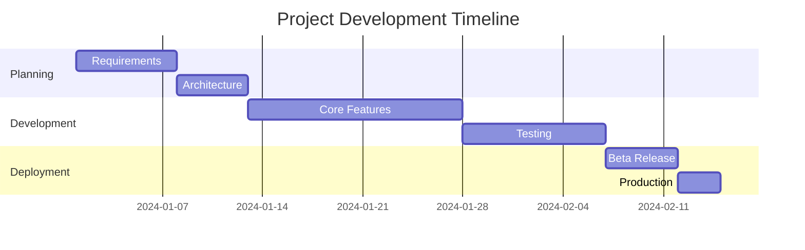
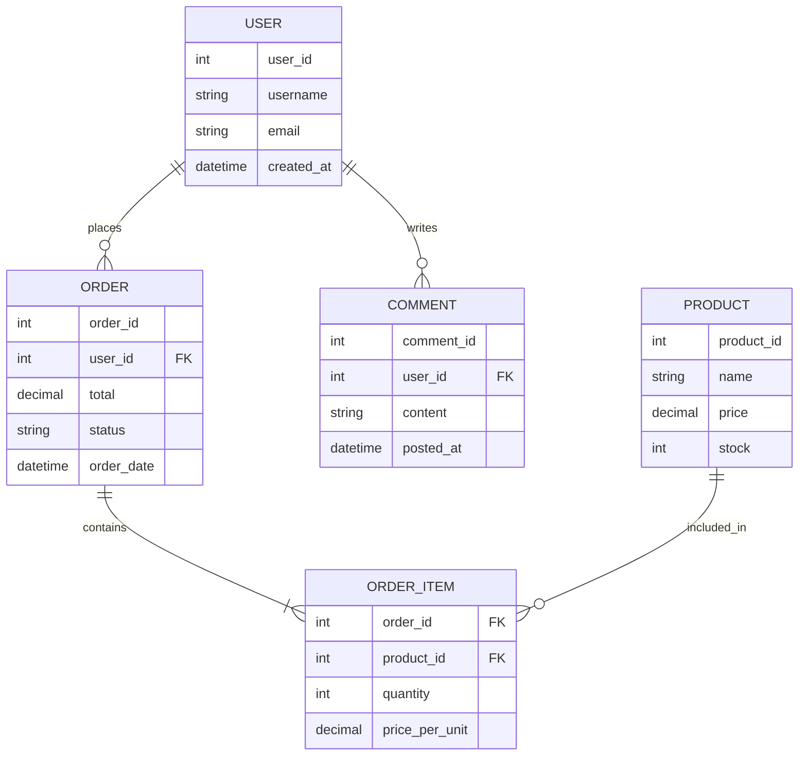
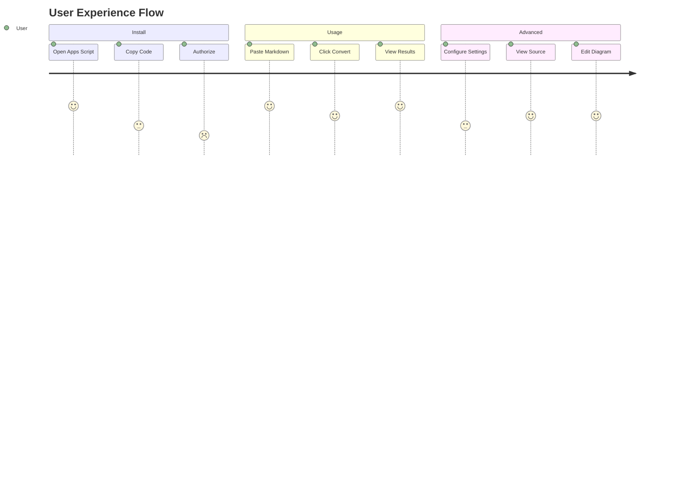

# Markdown Converter - Full Test Suite

This document tests **all supported markdown features** in a single file.
Download the raw code and paste into the converter.

---

## 1. Typography & Inline Styles

Regular paragraph text with **bold formatting**, *italic emphasis*, and ***bold italic combined***.

Alternative syntax: __underscore bold__ and _underscore italic_.

~~Strikethrough text~~ for deletions.

Inline code: `const x = 42`, `pip install pandas`, `cd /usr/local/bin`

Links: [Google Homepage](https://www.google.com), [GitHub](https://github.com), [Example](https://example.com)

Nested formatting: **bold with *italic* inside**, `code with **stars** inside`

---

## 2. Headers Hierarchy

# Heading Level 1 - Document Title

## Heading Level 2 - Major Section

### Heading Level 3 - Subsection

#### Heading Level 4 - Deep nested

##### Heading Level 5 - Very specific

###### Heading Level 6 - Deepest possible

---

## 3. Lists

### Unordered Lists
- First item with **bold text**
- Second item with *italic text*
- Third item with `inline code`
  - Nested level 1 - indented
  - Another nested with [link](https://example.com)
    - Deep nested level 2
    - Deep nested with **bold** and *italic*
- Back to top level
- Final item

Alternative bullets:
* Asterisk style
* Plus style works too
  * Nested under plus
  * Another nested
* Back to main

### Ordered Lists
1. First step in process
2. Second step with **important** note
3. Third step with `code reference`
   1. Sub-step A (nested number)
   2. Sub-step B with *emphasis*
      1. Deep nested step
      2. Another deep step
4. Return to main list
5. Final step number five

Mixed nesting:
1. Main ordered item
   - Unordered sub-item one
   - Unordered sub-item two
2. Second main item
   1. Ordered sub-item A
   2. Ordered sub-item B

---

## 4. Code Blocks

### Python Code Block
```python
def fibonacci(n):
    """Calculate Fibonacci sequence up to n terms."""
    if n &lt;= 0:
        return []
    elif n == 1:
        return [0]
    
    sequence = [0, 1]
    while len(sequence) &lt; n:
        next_val = sequence[-1] + sequence[-2]
        sequence.append(next_val)
    return sequence

# Example usage
result = fibonacci(10)
print(f"First 10 Fibonacci numbers: {result}")

class DataProcessor:
    def __init__(self, data):
        self.data = data
    
    def process(self):
        return [x * 2 for x in self.data if x &gt; 0]
```

### JavaScript Code Block
```javascript
// Async function with error handling
async function fetchUserData(userId) {
    try {
        const response = await fetch(`/api/users/${userId}`);
        if (!response.ok) {
            throw new Error(`HTTP error! status: ${response.status}`);
        }
        const data = await response.json();
        return processUserData(data);
    } catch (error) {
        console.error('Fetch error:', error);
        return null;
    }
}

const processUserData = (data) =&gt; {
    const { firstName, lastName, email } = data;
    return {
        ...data,
        fullName: `${firstName} ${lastName}`,
        lastLoginFormatted: new Date(data.lastLogin).toLocaleDateString()
    };
};

// Event listener
document.getElementById('submit').addEventListener('click', (e) =&gt; {
    e.preventDefault();
    console.log('Form submitted');
});
```

### JSON Data Block
```json
{
    "project": {
        "name": "GenAI Markdown Converter",
        "version": "2.0.0",
        "description": "Convert AI markdown to Google Docs"
    },
    "features": {
        "typography": true,
        "tables": true,
        "mermaid": true,
        "codeBlocks": true,
        "lists": true
    },
    "configuration": {
        "providers": ["mermaid.ink", "mermaidchart", "kroki"],
        "themes": ["neutral", "dark", "forest", "base"],
        "retention": ["alt", "caption", "comment", "none"]
    },
    "supportedLanguages": [
        "python",
        "javascript",
        "json",
        "java",
        "cpp",
        "html",
        "css",
        "sql"
    ]
}
```

### Generic Code Block (No Language)
```
This is plain text code block
    It preserves indentation
    And spacing exactly

No syntax highlighting applied
Just monospace formatting
```

---

## 5. Tables

### Simple Table
| Feature | Status | Priority |
|---------|--------|----------|
| Headers | Supported | High |
| Tables | Supported | High |
| Lists | Supported | Medium |
| Blockquotes | Supported | Low |
| Mermaid | Supported | High |

### Alignment Test
| Left Aligned | Center Aligned | Right Aligned |
|:-------------|:--------------:|--------------:|
| Default text | Centered text | Right text |
| Lorem ipsum | Sit amet | Dolor |
| Data science | Machine learning | AI tools |

### Complex Table with Inline Formatting
| Component | Description | Status |
|-----------|-------------|--------|
| **Parser** | Handles markdown *syntax* parsing | `Stable` |
| **Renderer** | Converts to **Google Docs** format | `Beta` |
| **Images** | Supports PNG/JPG via URLs | `Stable` |
| **Tables** | Full GFM table support | `Stable` |
| *UI* | Sidebar interface with tabs | `v2.0` |

---

## 6. Blockquotes

&gt; This is a single-line blockquote describing an important concept or note.

&gt; Blockquotes can span multiple lines.
&gt; Each line continues the quote.
&gt; They create visual emphasis.

&gt; **Bold text** works in blockquotes.
&gt; So does *italic text* and `inline code`.
&gt; Even [links work](https://example.com) inside blockquotes.

---

## 7. Mermaid Diagrams

### Flowchart Top-Down
```mermaid
graph TD
    A[Start Process] --&gt; B{Is it working?}
    B --&gt;|Yes| C[Great! Proceed]
    B --&gt;|No| D[Debug Issue]
    D --&gt; E[Check Logs]
    E --&gt; F[Fix Error]
    F --&gt; B
    C --&gt; G[Deploy to Production]
    G --&gt; H[End]
    
    style A fill:#e1f5fe
    style H fill:#c8e6c9
    style D fill:#ffccbc
```

### Sequence Diagram
```mermaid
sequenceDiagram
    participant User
    participant Sidebar
    participant AppsScript as Apps Script
    participant API as Mermaid API
    
    User-&gt;&gt;Sidebar: Paste Markdown
    Sidebar-&gt;&gt;AppsScript: Call convertMarkdown()
    AppsScript-&gt;&gt;AppsScript: Parse content
    
    loop For each Mermaid block
        AppsScript-&gt;&gt;API: Request PNG render
        API--&gt;&gt;AppsScript: Return image blob
        AppsScript-&gt;&gt;AppsScript: Insert image
        AppsScript-&gt;&gt;AppsScript: Store source (alt/comment)
    end
    
    AppsScript--&gt;&gt;Sidebar: Success response
    Sidebar--&gt;&gt;User: Show confirmation
    User-&gt;&gt;Sidebar: Click diagram
    Sidebar-&gt;&gt;User: Display source code
```

### Gantt Chart


### Class Diagram
```mermaid
classDiagram
    class Document {
        +String id
        +String title
        +Body body
        +getCursor()
        +insertParagraph()
        +insertTable()
    }
    
    class Body {
        +appendTable()
        +insertImage()
        +insertListItem()
    }
    
    class Converter {
        +parseMarkdown()
        +processContent()
        +insertMermaid()
    }
    
    class Settings {
        +String provider
        +String apiKey
        +String theme
        +save()
        +load()
    }
    
    Document "1" *-- "1" Body
    Converter ..&gt; Document : modifies
    Settings ..&gt; Converter : configures
```

### State Diagram
```mermaid
stateDiagram-v2
    [*] --&gt; Idle
    Idle --&gt; Processing : Paste Markdown
    Processing --&gt; Success : Valid Syntax
    Processing --&gt; Error : Invalid Syntax
    Success --&gt; Idle : Continue Editing
    Error --&gt; Idle : Fix Errors
    Success --&gt; [*] : Save & Close
    Error --&gt; [*] : Discard Changes
    
    note right of Success
        Image stored with
        source code in alt text
    end note
```

### ER Diagram


### User Journey Flow


---

## 8. Mixed Real-World Example

### Technical Specification Document

**Project:** GenAI Content Pipeline  
**Status:** `In Progress`  
**Priority:** Critical  
**Lead:** engineering@example.com

#### System Architecture

1. **Frontend Layer**
   - React.js `v18.2` with TypeScript
   - Tailwind CSS for styling
   - Redux for state management

2. **Backend Services**
   ```python
   # FastAPI application structure
   from fastapi import FastAPI, Depends
   from sqlalchemy.orm import Session
   
   app = FastAPI()
   
   @app.post("/api/convert")
   async def convert_document(
       request: ConvertRequest,
       db: Session = Depends(get_db)
   ):
       """Convert markdown to Google Doc format"""
       parser = MarkdownParser()
       result = await parser.process(request.content)
       return {"document_id": result.id}
   ```

3. **Database Schema**
   | Table | Purpose | Fields |
   |:------|:--------|:-------|
   | `users` | Authentication | id, email, password_hash |
   | `documents` | Doc storage | id, user_id, content, created_at |
   | `settings` | User preferences | user_id, provider, theme |

&gt; **Note:** All API endpoints require Bearer token authentication. Include header: `Authorization: Bearer &lt;token&gt;`

#### Deployment Flow

```mermaid
graph LR
    A[Developer] --&gt;|Push Code| B[GitHub]
    B --&gt;|Webhook| C[CI/CD]
    C --&gt;|Run Tests| D{Pass?}
    D --&gt;|Yes| E[Deploy to Staging]
    D --&gt;|No| F[Notify Developer]
    E --&gt;|Manual Approval| G[Deploy to Prod]
    G --&gt; H[Update CDN]
    F --&gt; A
    H --&gt; I[End]
    
    style D fill:#fff3e0
    style G fill:#e8f5e9
```

---

## 9. Edge Cases & Special Characters

### Escaped Characters
- Literal asterisk: \*not italic\*
- Literal underscore: \_not italic\_
- Literal backtick: \`not code\`
- Literal hash: \#not a header

### Mixed Content Paragraph
This paragraph tests **formatting** with *various* `styles` including ~~strikethrough~~ and [a link](https://example.com). It continues with more text to ensure `inline code` doesn't break the flow, and **bold with *nested italic*** works correctly.

### Code Inside Lists
- Item with `code` inside
- Item with **bold** and `code`
- Regular item
  - Nested `code item`
  - Nested **bold item**

---

## 10. Final Verification Checklist

- [x] All header levels render correctly
- [x] Bold, italic, and strikethrough work
- [x] Inline code renders with monospace font
- [x] Links are clickable and blue
- [x] Ordered lists with proper numbering
- [x] Unordered lists with bullet points
- [x] Nested list indentation correct
- [x] Code blocks preserve formatting
- [x] Tables with alignment work
- [x] Blockquotes indented properly
- [x] Mermaid diagrams render as images
- [x] Source code stored in alt text (check image properties)
- [x] Horizontal rules separate sections

---

**End of Test Document**

*Copy this entire document into the Markdown Converter to verify all features work correctly. Check that Mermaid diagrams render as images and that you can retrieve their source code via the "View Source" tab.*


